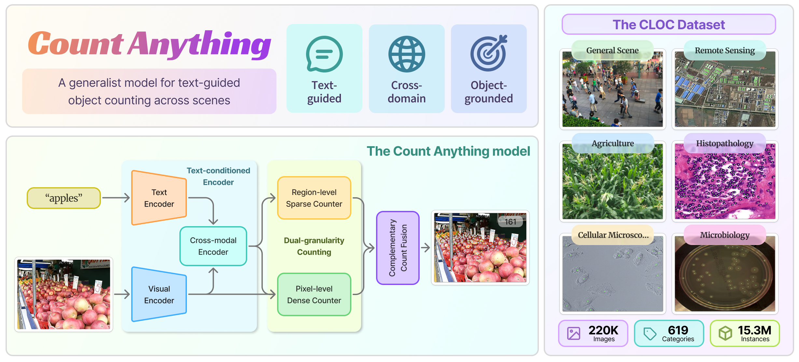
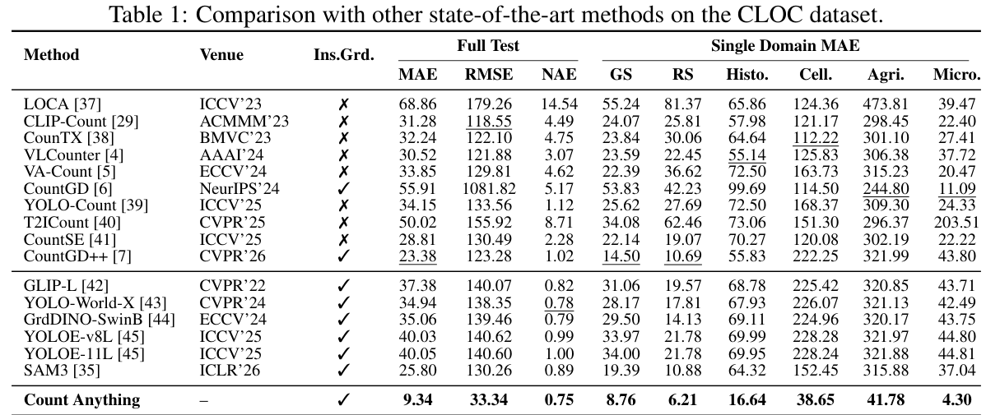

<h1 align="center">Count Anything</h1>

<p align="center">
  <strong>面向跨域文本引导目标计数的通用模型，以实例点集输出可解释计数结果</strong>
</p>

<p align="center">
  <a href="https://huggingface.co/MengqiLei/count-anything"></a>
  <a href="https://huggingface.co/spaces/MengqiLei/count-anything-demo"></a>
  <a href="https://arxiv.org/abs/xxxx.xxxxx"></a>
  <a href="assets/paper/Count-Anything.pdf"></a>
</p>

<p align="center">
  <a href="README.md">English</a> |
  <a href="README_CN.md">中文</a>
</p>

<p align="center">
  
</p>

## Overview 概览

本仓库介绍 **Count Anything**，这是一种用于跨域文本引导目标计数的通用模型。给定一张图像和一条自然语言查询，Count Anything 会返回一个实例级的目标点集合，其基数即为计数结果。这一表述方式将类别条件计数与具有可解释性的空间定位统一起来。

### 跨域文本引导计数

- 研究跨域文本引导目标计数，其中用户可以通过类别名称或自然语言查询来指定目标。
- 构建 **CLOC**，即 Cross-domain Large-scale Object Counting 数据集，将多种公开数据源重新组织为一个统一的计数基准。
- 覆盖六个视觉域：General Scene、Remote Sensing、Histopathology、Cellular Microscopy、Agriculture 和 Microbiology。

### 双粒度实例枚举

- 采用离散实例点作为最终预测形式，而不是将密度图作为最终输出。
- 使用 **Region-level Sparse Counter（RSC）** 为大目标和稀疏目标提供目标级锚定。
- 使用 **Pixel-level Dense Counter（PDC）** 通过密集点预测捕获小目标、拥挤目标和弱边界目标。

### 点中心监督与互补融合

- 将异构标注，包括 boxes、points、polygons、masks、rotated boxes 和 label maps，转换为计数点以及可选的边界框。
- 使用点中心监督，使每个有效实例都由一个点进行监督；只有在存在可靠边界框标注时，才使用边界框。
- 以无参数方式通过 **Complementary Count Fusion（CCF）** 结合 RSC 和 PDC，在抑制重复计数的同时保留二者的互补性。

Count Anything 在 CLOC 上进行训练与评估。CLOC 包含约 22 万张图像、619 个类别和 1500 万个目标实例。大量实验表明，Count Anything 具备较强的计数准确性和多域泛化能力，并显著优于现有开放世界计数方法。

## 主要结果



## 快速开始

### 1. 环境配置

创建 conda 环境并安装依赖：

```bash
conda create -n countanything python=3.12 -y
conda activate countanything
pip install -r requirements.txt
```

依赖列表有意保持最小化。如果默认的 pip 解析器没有选择你所需的 CUDA 版本，请安装与你本机 CUDA 版本匹配的 PyTorch 和 torchvision 构建版本。

### 2. 权重准备

如果只进行推理、验证或测试复现，只需要发布的 CountAnything checkpoint。请从 [Hugging Face](https://huggingface.co/MengqiLei/count-anything) 下载 `count_anything.pt`。

下载后，请将文件放置到：

```text
checkpoints/count_anything.pt
```

单独验证和测试配置会直接加载 `checkpoints/count_anything.pt`。

如果需要从 SAM3 初始化训练或微调 CountAnything，则还需要下载 SAM3 官方预训练权重。由于权限和再分发限制，本仓库不直接提供 SAM3 官方预训练权重。请访问 SAM3 官方 Hugging Face 页面：

[Hugging Face](https://huggingface.co/facebook/sam3)

下载 SAM3 预训练权重 `sam3.pt`，并放置到：

```text
pretrained/sam3.pt
```

请注意，应下载 **SAM3** 的权重，而不是 SAM3.1 的权重。期望的文件名是：

```text
sam3.pt
```

默认情况下，训练配置会使用 `pretrained/sam3.pt` 初始化模型。

### 3. 数据准备

本仓库默认使用 CLOC 数据集。数据集准备文档会说明如何下载 CLOC 标注包、可直接发布的增强图片包，以及各个源数据集的原始图片。请先按照数据集准备文档完成数据组织，再运行训练或评估。

默认配置期望训练、验证和测试标注位于：

```text
data/annotations/train_split_expanded_by_class.json
data/annotations/val_split_expanded_by_class.json
data/annotations/test_split_expanded_by_class.json
```

每条样本对应一个图像-类别计数任务。标注文件应提供图像路径、类别文本，以及该类别对应的 point / bbox 标注。图像文件的实际位置由标注中的 `image_path` 字段指定。

数据集目录形式如下：

```text
data/
  annotations/        # CLOC train/val/test JSON
  images/             # 原始数据集下载和解压目录
  augmented/          # CLOC 标注引用的增强图片
  tools/              # 数据转换、增强图片重建和审计脚本
  README.md           # English dataset preparation guide
```

完整的数据集构建、原始数据集下载、格式转换、增强图片重建和路径审计流程，请参考：

```text
data/README.md
```

如果你的数据目录不同，请修改：

```text
config/count_anything_train_cloc.yaml
config/count_anything_val_cloc.yaml
config/count_anything_test_cloc.yaml
```

中的 `paths.train_annotation_file` 和 `paths.val_annotation_file`，使其指向本地标注文件。

### 4. 训练

训练直接通过 `train.sh` 启动：

```bash
CUDA_VISIBLE_DEVICES=0,1,2,3 \
NUM_GPUS=4 \
bash train.sh
```

默认情况下，`train.sh` 使用：

```text
config/count_anything_train_cloc.yaml
```

该配置对应本文主要模型设置：使用 SAM3 预训练权重初始化，启用 RSC、PDC 和 CCF，训练 LoRA 参数与计数分支。LoRA learning rate 为 `1e-3`，学习率采用 30 epoch 的 cosine schedule，`min_lr_ratio=0.1`。

训练过程中每个 epoch 的验证默认使用：

```text
data/annotations/val_split_expanded_by_class.json
```

默认训练参数包括：

- `train_batch_size=18`
- `val_batch_size=40`
- `max_epochs=30`
- `val_epoch_freq=1`
- `visualize_val_every_n_epochs=5`

训练运行后，日志、可视化结果和 checkpoints 会默认保存到：

```text
exp/count_anything_train_cloc/
```

如果需要修改数据路径、batch size、epoch 数或输出目录，请编辑：

```text
config/count_anything_train_cloc.yaml
```

### 5. 验证

使用 `val.sh` 进行单独验证：

```bash
CUDA_VISIBLE_DEVICES=0,1,2,3 \
NUM_GPUS=4 \
bash val.sh
```

默认情况下，`val.sh` 使用：

```text
config/count_anything_val_cloc.yaml
```

该配置会加载：

```text
checkpoints/count_anything.pt
```

并在 CLOC 验证集上进行评估：

```text
data/annotations/val_split_expanded_by_class.json
```

验证日志和预测统计结果默认保存到：

```text
exp/count_anything_val_cloc/
```

如果需要验证其他 checkpoint 或其他验证集，请修改：

```text
config/count_anything_val_cloc.yaml
```

中的 checkpoint 路径和 `paths.val_annotation_file`。

### 6. 测试

使用 `test.sh` 评估 checkpoint：

```bash
CUDA_VISIBLE_DEVICES=0,1,2,3 \
NUM_GPUS=4 \
bash test.sh
```

默认情况下，`test.sh` 使用：

```text
config/count_anything_test_cloc.yaml
```

该配置会加载：

```text
checkpoints/count_anything.pt
```

并在 CLOC 测试集上进行评估：

```text
data/annotations/test_split_expanded_by_class.json
```

测试日志和预测统计结果默认保存到：

```text
exp/count_anything_test_cloc/
```

如果需要评估其他 checkpoint 或其他测试集，请修改：

```text
config/count_anything_test_cloc.yaml
```

中的 checkpoint 路径和 `paths.val_annotation_file`。

## 仓库结构

```text
CountAnything/
  train.sh                         # 默认训练入口
  val.sh                           # 默认验证入口
  test.sh                          # 默认测试入口
  requirements.txt                 # Python 依赖
  config/
    count_anything_train_cloc.yaml # CLOC 训练配置
    count_anything_val_cloc.yaml   # CLOC 验证配置
    count_anything_test_cloc.yaml  # CLOC 测试配置
  count_anything/
    model/                         # CountAnything 模型组件
    train/                         # 训练器、loss 和 matcher
    eval/                          # 后处理和计数评估
  sam3/                            # 预训练 SAM3 图像-语言编码骨干实现
  pretrained/
    sam3.pt                        # SAM3 预训练权重放置位置
  checkpoints/
    count_anything.pt               # CountAnything checkpoint 放置位置
  data/                            # CLOC 数据集标注和数据准备工具
  exp/                             # 训练和测试输出目录
```

## 问题与支持

如果您在数据集准备、模型权重、训练、验证或测试过程中遇到任何困难，欢迎及时与我们联系，我们会尽力提供帮助。
